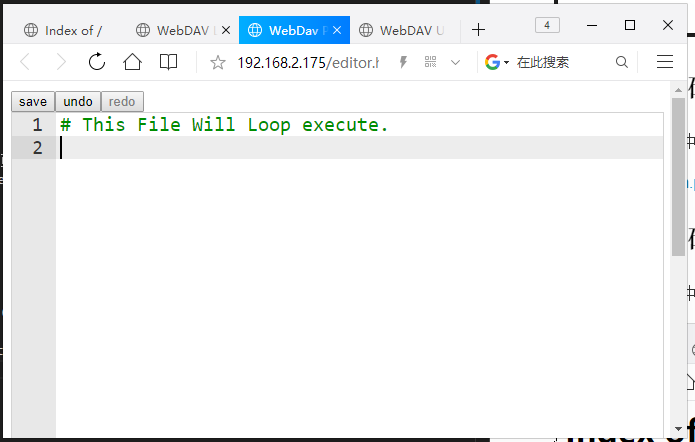

# Bpibit 浏览器在线编程

[TOC]

## 这是什么？

&emsp;&emsp;这是一个提供给 BpiBit 的一套 WebDAV 浏览器在线管理工具（或称软固件）。

## 如何安装？

&emsp;&emsp;在板子的WebDAV空间中放置以下文件即可，如图所示。

- 

&emsp;&emsp;从图中可知板子 IP : 192.168.2.175 ，所以访问该地址时，可以看到刚才所放入的文件已经存在内部。

- 

## 有什么用?

### 1. 浏览 py 代码文件

&emsp;&emsp;我们可以点击 list.htm 文件，进入下图所示页面，在这页面上我们可以得知文件的名称和大小以及对应的操作，例如 Python 代码编辑器、Text 文本编辑器、Delete 删除文件，而点击顶部的 Upload New File 将新建链接到 upload.htm 页面上传文件。

- 

### 2. 编辑 py 代码文件

&emsp;&emsp;在浏览文件的页面中，可以点击对应文件右侧 Operator 一列的按钮执行对应的编辑操作。

&emsp;&emsp;例如我点击 system.py 文件的 Python Editor 按钮，页面如图所示。

- 

&emsp;&emsp;在该页面支持 Windows 下的 Python 编辑器的常用快捷键，例如：保存（Ctrl + s）、撤销（Ctrl + z）、复制（Ctrl + c）、粘贴（Ctrl + v）、查找（Ctrl + f）、注释（Ctrl + /）、代码右移（选中段 + Tab）、代码左移（选中段 + Shift + Tab）等等。

&emsp;&emsp;但该编辑器需要网络加载 Js 与 Css 等组件，如果没有网络可以点击 Text Editor 按钮，页面如图所示。

- 

&emsp;&emsp;虽然简陋了一点，但还是可以用的，唯一的按钮（Click Save File）就是保存文件。

### 3. 上传 py 代码文件

&emsp;&emsp;在浏览文件的页面中，可以点击 Upload New File 新建链接到 upload.htm ，点开后如图所示。

- 

&emsp;&emsp;你只需要将你想要上传的代码文件拖到这个编辑框就可以了，效果如图。

- 

&emsp;&emsp;确认没问题后，点击上按钮即可，此时可以回到浏览文件列表页面查看内容，或刷新编辑器查看更新文件等。

- 

## 浏览文件页面不支持 IE 内核的原因

&emsp;&emsp;因为 IE 浏览器不支持 Table 标签的 innerHTML 属性，所以加载不到 `<table>`标签上，要兼容两者接口也很麻烦，所以使用的不是IE内核的浏览器就行了。
